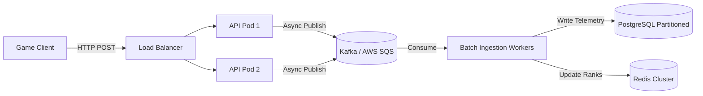

# Game Ops System Design Document

This document provides the systems design, architecture, and production-scaling plan for the Game Ops telemetry, anti-cheat, and matchmaking system.

---

## 1. Problem Understanding
The game team needs a system that can ingest player match records during high-traffic events, analyze the telemetry in real-time, and produce three outputs:
1. **A fair leaderboard** that ranks players while preventing fraudulent scores from ruining the competitive integrity of the game.
2. **A security reporting log** identifying cheaters with explicit classifications and reasoning.
3. **Optimized matchmaking lobbies** that group clean players together based on region (minimizing ping) and skill levels.

---

## 2. System Assumptions
- **Ingestion model**: telemetry is sent by client game applications via HTTP post requests at the end of each match.
- **Cheater policy**: players flagged as **High** severity are excluded from matchmaking entirely. Players flagged as **Medium** severity are quarantined in isolation lobbies for manual review. Players flagged as **Low** severity are allowed to play but are tagged for monitoring.
- **Ranking priority**: competitive score is the primary metric, with tie-breakers decided by deaths (fewer is better), then kills, then match participation.

---

## 3. Data Schema
To represent this system in a relational database (e.g., PostgreSQL), we define two core schemas:

### Match Telemetry Schema (`matches` table)
Represents the raw, match-level metrics uploaded from game clients.
- `match_id` (VARCHAR, Primary Key Part 1)
- `player_id` (VARCHAR, Primary Key Part 2)
- `region` (VARCHAR)
- `device` (VARCHAR)
- `ping` (INT)
- `score` (DOUBLE PRECISION)
- `kills` (INT)
- `deaths` (INT)
- `match_duration_seconds` (INT)
- `score_per_second` (DOUBLE PRECISION, Derived Index)
- `kd_ratio` (DOUBLE PRECISION, Derived)
- `created_at` (TIMESTAMP, default: current timestamp)

### Player Analytics Schema (`players` table)
Aggregated metrics updated periodically or via database triggers.
- `player_id` (VARCHAR, Primary Key)
- `total_score` (DOUBLE PRECISION)
- `total_kills` (INT)
- `total_deaths` (INT)
- `matches_played` (INT)
- `primary_region` (VARCHAR)
- `skill_score` (DOUBLE PRECISION)
- `cheat_status` (VARCHAR, e.g. 'clean', 'under_review')
- `cheat_severity` (VARCHAR, e.g. 'None', 'Low', 'Medium', 'High')
- `flag_reasons` (TEXT)
- `updated_at` (TIMESTAMP)

---

## 4. Production Architecture (Scaling to 200,000+ Players)
To scale this prototype to handle hundreds of thousands of active matches, we must shift from a synchronous in-memory architecture to a decoupled, event-driven architecture.

### Ingestion Flow

### 1. Ingestion Layer (FastAPI & Load Balancer)
- **FastAPI** instances run as stateless pods in a containerized cluster (e.g., AWS EKS).
- A **Network Load Balancer** distributes requests. If traffic spikes, auto-scaling adds pods based on CPU/Request rate.
- Rather than waiting for database writes, the APIs publish match records to a message broker in `< 10ms` and return `202 Accepted` to the client.

### 2. Messaging Broker (Apache Kafka / AWS SQS)
- Buffers high-frequency score events.
- decouples the game client from backend processing speed.
- If the database goes down or becomes congested, Kafka holds the logs safely, preventing data loss.

### 3. Processing & Analytics Layer (Flink / Spark)
- **Real-Time Cheat Detection**: Apache Flink consumes the Kafka stream, running immediate threshold evaluations (Rules 1–5). If triggered, it publishes alerts.
- **Historical Analysis (Z-score outlier detection)**: An Apache Spark batch job runs every 10 minutes, computing player-level statistics and updating $Z$-scores in the database.

### 4. Database Layer (PostgreSQL Partitioning)
- The primary PostgreSQL database partitions the `matches` table by `region` and `created_at` date.
- This keeps partition sizes small, ensuring indexing and search queries remain fast.

### 5. Leaderboard Cache (Redis Sorted Sets)
- Querying rankings directly from SQL databases using `ORDER BY` is extremely slow at scale.
- We cache ranks in a **Redis Sorted Set** (`zset`) where key is the region (or global) and player IDs are members, scored by `total_score`.
- Updates use `ZADD` (takes $O(\log N)$ time). Reading the top 100 uses `ZREVRANGE` (takes $O(\log N + M)$ time, served in `< 5ms`).

### 6. Monitoring & Telemetry
- **Prometheus** scrapes system performance (API latency, queue backlogs, database lock counts).
- **Grafana** dashboards show real-time telemetry for operations teams, featuring charts for:
  - Ingestion rates (Matches / sec)
  - API p99 response times
  - Kafka consumer group lag (identifies slow processing)
  - Flagged player alerts over time

---

## 5. System Limitations & Future Enhancements
- **Dynamic Thresholds**: The current rules use fixed limits. In production, we should adjust thresholds based on game meta changes and weapon balances using historical distribution profiles.
- **API Security**: Endpoints currently lack authentication. In production, requests should require HMAC signatures based on game client secrets to prevent score tampering.
- **Active Matchmaking Queue**: The matchmaking lobby suggestion is currently static. A production system should use a live queue (e.g., using Open Match) that matches players dynamically, loosening skill constraints if wait times exceed a maximum duration.
